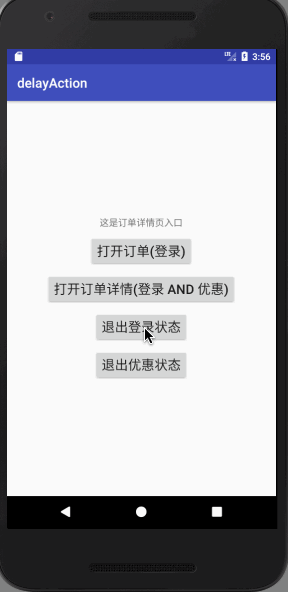

### 如何延迟执行目标行为

例如我们有时候会有这样的需求，那就是在执行目标行为时候，需要执行前置的一些行为。而这些前置行为，需要用户参与才能完成，或者这些前置
行为要跳转到另外一个未知上下文中执行。

典型应用场景：

例如我们需要跳转到目标界面之前，进入登录界面，并成功登录后，再进入到目标界面。

那么我们如何实现这种需求呢？请教参我的博客分析[android 登录成功后再跳转到目标界面的思考](http://www.jianshu.com/p/1d0180ec64fb)


### 1、基本执行流程图如下


### 2、演示图如下

只需要进行登录的验证



只需同时进行登录和优惠券的难


### 3、代码调用如下

调用目标方法
```

CallUnit.newInstance(MainActivity.this)
         .addValid(new LoginValid(MainActivity.this))
         .addValid(new DiscountValid(MainActivity.this))
         .doCall();
```

完成valid检验后，再执行即可。
```
CallUnit.reCall()

```

当然每个对应的验证模型需要自己去完成，例如LoginValid的模型

```
package com.goodluck.abbott.valid;

import android.app.Activity;
import android.content.Context;

import com.goodluck.abbott.LoginActivity;
import com.goodluck.abbott.UserConfigCache;
import com.toptechs.libaction.action.Valid;

/**
 * Created by jinyabo on 8/12/2017.
 */

public class LoginValid implements Valid {
    private Context context;

    public LoginValid(Context context) {
        this.context = context;
    }

    /**
     * check whether it login in or not
     * @return
     */
    @Override
    public boolean check() {
        return UserConfigCache.isLogin(context);
    }


    /**
     * if check() return false. then doValid was called
     */
    @Override
    public void doValid() {
         LoginActivity.start((Activity) context);
    }
}
```

然后要记得依赖我们的lib工程哦

```
dependencies {
    compile project(':libaction')
}
```

### 4、小彩蛋

其实libaction工程也实现了注解调用的实现。但是前提是所有的检验模型不需要传入额外的参数才行。 具体看代码

```
    /**
     * 通过反射注解来组装(但是这个前提是无参的构造方法才行)
     *
     * @param action
     */
    public void postCallUnit(Action action) {
        Class clz = action.getClass();
        try {
            Method method = clz.getMethod("call");
            Interceptor interceptor = method.getAnnotation(Interceptor.class);
            Class<? extends Valid>[] clzArray = interceptor.value();
            CallUnit callUnit = new CallUnit(action);
            for (Class cla : clzArray) {
                callUnit.addValid((Valid) cla.newInstance());
            }

            postCallUnit(callUnit);
        } catch (NoSuchMethodException e) {
            e.printStackTrace();
        } catch (InstantiationException e) {
            e.printStackTrace();
        } catch (IllegalAccessException e) {
            e.printStackTrace();
        }
    }

```